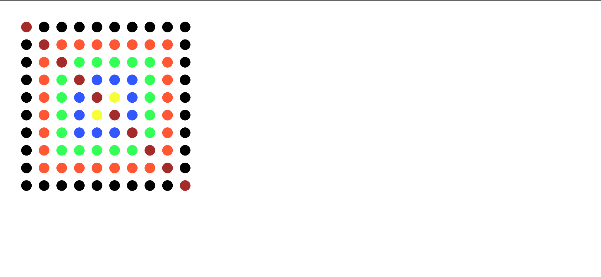

# HW03B

## Make an Art: Experiments with loops

This project is a creative exploration of gridded patterns, created as part of HW03B . The program generates a structured yet visually dynamic grid of circles, with color variations and specific elements like the main diagonal and border rows/columns.

The design balances simplicity and creativity, showcasing the use of nested loops and color palettes to create unique compositions.

Output Image on repo:  

